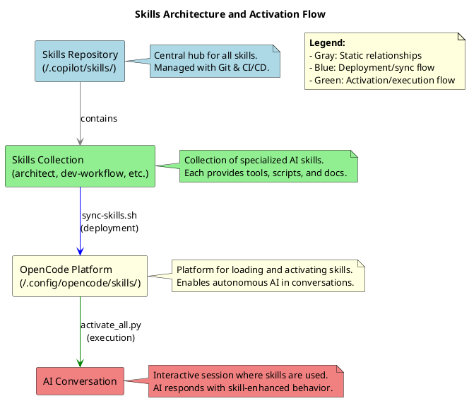

# Development Workflow Skill Guide

## Description
The `dev-workflow` skill ensures consistent project setup, version control, and adherence to organizational standards. Covering everything from Git branching to AI project scaffolding, these workflows are mandatory for all new projects and collaboration tasks.

## When to Use the Skill
- **Setting up a repository or project:** Ensure correct structures, environments, and configurations.
- **Version control workflows:** Commit, branch management, and Gitflow adherence.
- **AI/ML-specific needs:** Proper Python package management, environments, and coding standards.
- **Synchronizing or updating project artifacts:** Ensure clean execution of project syncs.

## Usage Guide
### Setting Up AI/ML Projects
#### Scaffold a New Project
```bash
uv init --lib <project_name>
uv python pin 3.12
```
- Creates the project structure and pins the Python version.
- Populate `pyproject.toml` and configure `uv.lock` for dependencies.

#### Example Gitignore
```plaintext
# Python artifacts
__pycache__/
.venv
*.pyc

# Data directories
data/
```

### Git Workflow
#### Branch Creation
Keep branch names descriptive of the feature or fix:
```bash
git checkout -b feat/user-auth
git checkout -b fix/login-timeout
```
- Feature/fix branches merge to `develop`.
- Ensure all commits follow the Conventional Commits format.

#### Commit Workflow
1. Use `git status` and `git diff` to identify changes.
2. Avoid staging sensitive files (e.g., `.env`, credentials).
3. Write a semantic commit message (example):
   ```bash
   git commit -m "fix(login): handle timeout edge cases"
   ```

### CI/CD Workflow
#### Fetch CI Logs
Fetch specific logs from GitHub Actions workflows for debugging:
```bash
gh run list --workflow "Skill Validation CI" --json status,conclusion,headSha | jq '.[] | select(.conclusion == "failure") | .headSha' | xargs -I {} gh run view {} --log
```
- Requires GitHub CLI (`gh`); outputs logs for failed runs.

#### Auto-Correct Common CI Issues
Run auto-correction for known errors (e.g., file size, validation):
```bash
python3 scripts/auto_correct_ci.py --workflow "Skill Validation CI" --commit <commit-sha>
```
- Detects and fixes issues like oversized assets; re-commits if needed.

#### Automated CI/CD with GitHub Actions
The repository includes automated CI/CD monitoring via `.github/workflows/auto-correct-ci.yml`:
- Triggers on CI failures (e.g., "Skill Validation CI").
- Iterates auto-corrections up to 5 times for all common issues (linting, tests, builds, deps, YAML, file size).
- Notifies via GitHub issue if fails after 5 attempts.

### Skills Architecture Diagrams
Visual representation of the skills ecosystem and activation flow:
- Central repository connects to individual skills.
- Sync process links skills to platforms like OpenCode.
- Automatic validation and loading at conversation start enables autonomous AI behavior.



*(Diagram generated from `assets/diagrams/skills-architecture.puml` using PlantUML. Run `python3 scripts/generate_diagrams.py --diagram skills-architecture` to regenerate PNG automatically. If PlantUML is missing, uses @sys-env for installation.)*

#### Diagram Generation
Automatically generate PNG diagrams from PlantUML sources:
```bash
python3 scripts/generate_diagrams.py --diagram <diagram_name>
```
- Checks for PlantUML installation; if missing, integrates with @sys-env for safe installation on Arch Linux.
- Generates PNG in the same directory as the .puml file.
- Verifies PNG (existence, size >0) and auto-corrects by retrying up to 5 times if fails.
- Example: `python3 scripts/generate_diagrams.py --diagram skills-architecture` creates `skills-architecture.png`.

## Inputs and Outputs
### Inputs
- **Repository context:** Current Git state (branches, changes).
- **Project environment:** Python version, package manager configurations, or AI frameworks required.

### Outputs
- **Git changes:** Staged/stable commits reflecting best practices.
- **Project files:** Well-organized structure based on `uv` or repo templates.

## Best Practices and Version History
### Best Practices
- **Git:** Always work on feature branches; avoid direct `main` commits.
- **AI Projects:** Use `uv` for reproducible environments; pin Python versions.
- **CI/CD:** Monitor workflows after commits; use auto-correct for common issues.

### Version History
| Version | Date       | Updates                                                  |
|---------|------------|---------------------------------------------------------|
| 1.5.0   | 2026-02-11 | Added automatic diagram generation with sys-env integration.|
| 1.4.0   | 2026-02-11 | Added skills architecture diagrams in PlantUML style.   |
| 1.3.0   | 2026-02-10 | Added automated CI/CD with GitHub Actions integration, email notifications, and all corrections.|
| 1.2.0   | 2026-02-10 | Added CI/CD workflow for log sharing and auto-correction.|
| 1.1.0   | 2026-02-09 | Reorganized content into SKILL.md standard template.    |
| 1.0.0   | 2024-11-03 | Initial workflow for AI/ML projects and Git workflows.  |

## Resources
- `references/ci-cd-best-practices.md`: CI/CD monitoring and troubleshooting guides.